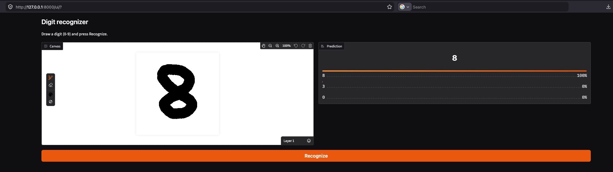

# Digit recognizer




Draw a digit with the mouse, get a prediction. A small MLP trained on MNIST
sits behind a FastAPI JSON API; the drawing UI is Gradio, mounted on the same
server and talking to the API over HTTP like any other client would.

## Overview

Three layers, from the inside out:

1. **Model logic** — `model.joblib` (scikit-learn MLP) plus the image
   preparation code in `app.py` that turns an arbitrary drawing into the
   28x28 format MNIST models expect.
2. **REST API** — FastAPI. Request and response bodies are described with
   Pydantic models (`PredictRequest`, `PredictResponse`), which gives input
   validation and the interactive docs at `/docs` for free.
3. **UI** — a Gradio sketchpad mounted at `/ui`. Its callback encodes the
   canvas as PNG and POSTs it to `/predict`, so the UI is a thin client and
   the API stays fully usable on its own (curl, scripts, other services).

## Deployment

Everything runs as a single uvicorn process defined in `app.py`. The Gradio
app is attached to the FastAPI app with `gr.mount_gradio_app(...)`, so one
`python app.py` serves both the API and the UI on port 8000. The model is
loaded once at startup.

The UI finds the API through the `API_URL` environment variable (default
`http://127.0.0.1:8000`). If you run the server on a different port, set
`API_URL` accordingly.

## Installation

Python 3.10+.

```
python -m venv venv
source venv/bin/activate        # Windows: venv\Scripts\activate
pip install -r requirements.txt
python app.py                   # or: uvicorn app:app --port 8000
```

Then open http://127.0.0.1:8000/ui (the drawing page) or
http://127.0.0.1:8000/docs (interactive API docs).

The trained model (`model.joblib`) is included. To retrain from scratch:

```
python train.py
```

This downloads MNIST (~11 MB) from a GitHub mirror into `data/`, trains the
network and overwrites `model.joblib`. Takes under a minute on a modern CPU.

## Model

`sklearn.neural_network.MLPClassifier`: 784 -> 256 -> 10, ReLU, Adam,
batch size 256, 15 epochs on the full 60k MNIST training set.
**Test accuracy: 97.95%.**

The part that matters most for recognizing *drawn* digits is preprocessing.
MNIST digits are white-on-black, scaled to fit a 20x20 box and centered on a
28x28 field by their center of mass. A raw canvas screenshot looks nothing
like that, so `prepare()` in `app.py` redoes the same normalization:

1. flatten transparency onto white, convert to grayscale;
2. invert if the drawing is dark-on-light (MNIST is light-on-dark);
3. drop near-zero noise, crop to the bounding box of the ink;
4. resize the crop to fit 20x20 keeping aspect ratio;
5. paste onto a 28x28 field so the center of mass lands in the middle;
6. scale to [0, 1] and flatten to a 784-vector.

Sanity check: 200 MNIST test digits re-rendered as "drawings" (enlarged,
black-on-white, pasted at random positions on a 280x280 canvas) go through
the whole pipeline with 99% accuracy, so the normalization holds up.

An MLP was chosen over a CNN to keep the dependency list down to
scikit-learn — no deep learning framework needed, and the accuracy is enough
for this task.

## Interface

### HTTP endpoints

| Method, path    | Input                                     | Output                                          | Description |
|-----------------|-------------------------------------------|--------------------------------------------------|-------------|
| `GET /`         | —                                         | 307 redirect                                     | Redirects to `/ui`. |
| `GET /health`   | —                                         | `{"status", "model", "classes"}`                 | Liveness check, confirms the model is loaded. |
| `POST /predict` | JSON `{"image": "<base64 PNG/JPEG>"}`     | `{"digit": int, "confidence": float, "probabilities": {"0"..."9": float}}` | Main endpoint: decodes the image, normalizes it, returns the predicted class and per-class probabilities. `400` if the payload is not an image or the canvas is empty. |
| `GET /ui`       | —                                         | HTML                                             | The Gradio drawing page. |
| `GET /docs`     | —                                         | HTML                                             | Auto-generated OpenAPI docs (from the Pydantic schemas). |

Example exchange:

```
POST /predict
{"image": "iVBORw0KGgoAAAANS..."}

200 OK
{"digit": 7, "confidence": 1.0, "probabilities": {"0": 0.0, ..., "7": 1.0, ...}}
```

### UI event handlers

| Event                     | Handler       | Input                          | Output | What it does |
|---------------------------|---------------|--------------------------------|--------|--------------|
| "Recognize" button click  | `recognize()` | Sketchpad value (layered image dict, `composite` is used) | `gr.Label` | Encodes the canvas as PNG, POSTs it to `/predict`, shows the top-3 classes with probabilities. Raises a visible error if the canvas is empty or the API is unreachable. |
| Canvas clear / undo       | built into `gr.Sketchpad` | — | — | Standard sketchpad controls. |

## Example run

Real captured logs are in `logs_example.txt`: server startup, a `GET /health`
and a `POST /predict` hit on the server side, and the client-side response
JSON for `sample_digit.png` (an MNIST test digit rendered as a drawing,
correctly recognized as 7).

To reproduce: start the server, then in a second terminal run

```
python example_request.py sample_digit.png
```

For a UI screenshot, open http://127.0.0.1:8000/ui, draw a digit and press
Recognize.

## Files

```
app.py              API + UI, the deployment script
train.py            downloads MNIST and trains the model
model.joblib        trained model (included)
example_request.py  minimal API client
sample_digit.png    test image for the client
requirements.txt    pinned dependencies
logs_example.txt    captured server/client logs
```
