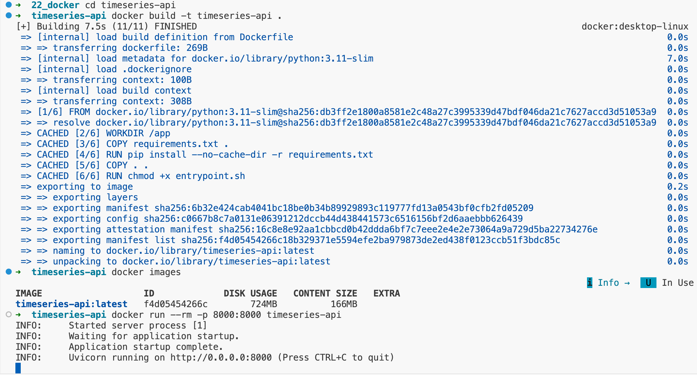
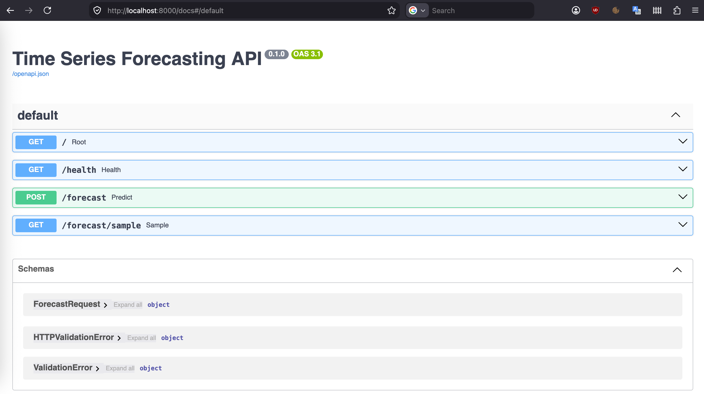
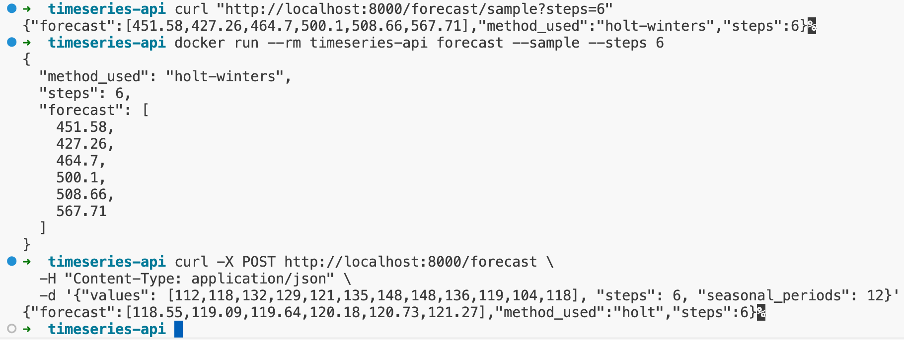

# Time Series Forecasting API

A small FastAPI service that forecasts a univariate time series using
Holt-Winters exponential smoothing. It is packaged with Docker so that a single
image can either serve the API or run a command-line forecast, depending on the
arguments passed to `docker run`.

## Project structure

```
timeseries-api/
├── main.py           # FastAPI app and endpoints
├── forecasting.py    # forecasting logic + built-in sample dataset
├── cli.py            # command-line forecast script
├── entrypoint.sh     # dispatcher: picks what to run from the arguments
├── Dockerfile
├── requirements.txt
├── .dockerignore
├── data/
│   └── example.csv   # sample CSV for the CLI
└── screenshots/
    ├── scr_1_docker_build_run.png
    ├── scr_2_app_running.png
    └── scr_3_sample.png
```

## Requirements

- Docker installed and running (Docker Desktop on Windows/macOS, or Docker
  Engine on Linux).

## Build

From inside the project folder:

```bash
docker build -t timeseries-api .
```



## Run the API

```bash
docker run --rm -p 8000:8000 timeseries-api
```

With no extra argument the container starts the API server (the `serve` default
from `CMD`). Once it is up, open <http://localhost:8000/docs> to try the
endpoints interactively.



### Endpoints

| Method | Path                 | Description                                |
|--------|----------------------|--------------------------------------------|
| GET    | `/health`            | Liveness check                             |
| GET    | `/forecast/sample`   | Forecast the built-in airline dataset      |
| POST   | `/forecast`          | Forecast a series sent in the request body |

Example request to `POST /forecast`:

```json
{
  "values": [112, 118, 132, 129, 121, 135, 148, 148, 136, 119, 104, 118],
  "steps": 6,
  "seasonal_periods": 12,
  "method": "auto"
}
```

`method` is one of `auto`, `holt-winters`, `holt`, or `ses`. In `auto` mode the
service uses Holt-Winters when `seasonal_periods` is given and there are at least
two full seasons of data, otherwise it falls back to a simpler model.

## Running a different script via `docker run`

The image uses `ENTRYPOINT` together with `CMD`, so the first argument to
`docker run` decides what runs inside the container:

```bash
# default: no argument -> serve the API
docker run --rm -p 8000:8000 timeseries-api

# run the command-line forecast on the built-in sample data
docker run --rm timeseries-api forecast --sample --steps 6

# run it on a CSV file
docker run --rm timeseries-api forecast --input data/example.csv --column passengers

# anything else is run as-is, e.g. an interactive shell
docker run --rm -it timeseries-api bash
```



### How it works

The relevant lines in the `Dockerfile`:

```dockerfile
ENTRYPOINT ["./entrypoint.sh"]
CMD ["serve"]
```

`ENTRYPOINT` always runs (`entrypoint.sh`) and is not replaced by the arguments
you type. `CMD` only provides the default argument. When you run
`docker run timeseries-api forecast --sample`, the `forecast --sample` part
replaces the `serve` default, so the entrypoint receives it and dispatches to
the CLI instead of the server. Inside `entrypoint.sh` a `case` statement matches
the first argument: `serve` starts the API, `forecast` runs the CLI, and
anything else is executed verbatim.
